# Homelab Infrastructure

A personal homelab project built after finishing my first year of ASIR to learn how real infrastructure is deployed and managed.

The goal is to recreate a small enterprise environment from scratch using Linux servers, automation, containers, monitoring, backups and cloud technologies instead of configuring isolated services one by one.

This repository contains all the configuration, documentation and screenshots of every phase.

---

## Goals

- Build an isolated multi-server infrastructure.
- Configure a Linux gateway with routing, NAT and firewall rules.
- Automate server provisioning with Ansible.
- Deploy applications using Docker.
- Implement PostgreSQL high availability.
- Monitor the infrastructure with Prometheus and Grafana.
- Configure automated backups.
- Replicate part of the infrastructure in Azure using Terraform.

---

## Infrastructure

 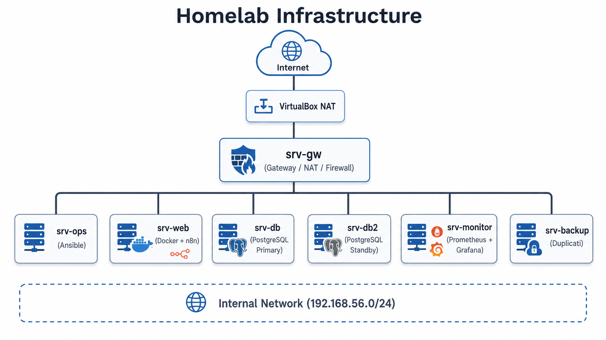

---

## Technologies

| Technology | Purpose |
|------------|---------|
| Ubuntu Server | Operating system for every server |
| VirtualBox | Local virtualization platform |
| Ansible | Configuration management and automation |
| Docker | Containerized services |
| PostgreSQL | Database and streaming replication |
| Prometheus | Metrics collection |
| Grafana | Monitoring dashboards |
| Duplicati | Scheduled backups |
| SSHFS | Remote backup mounts |
| Terraform | Infrastructure as Code |
| Azure | Cloud environment |

---

# Project Progress

## Phase 1 — Base infrastructure

Created the Ubuntu Server template and deployed all virtual machines.

**Screenshots**

- 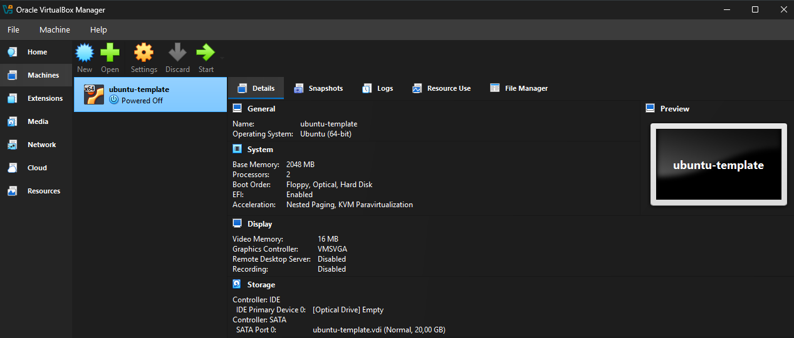
- 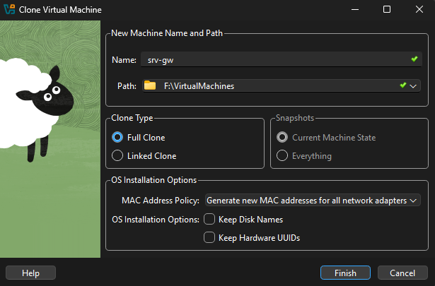

---

## Phase 2 — Gateway & Networking

Configured **srv-gw** as the gateway for the internal network.

Implemented:

- IPv4 forwarding
- NAT with nftables
- Internal routing
- Network configuration

**Screenshots**

- 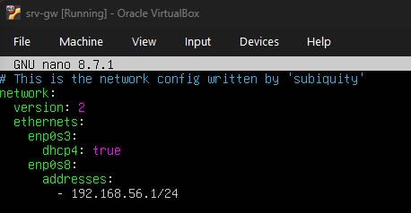
- 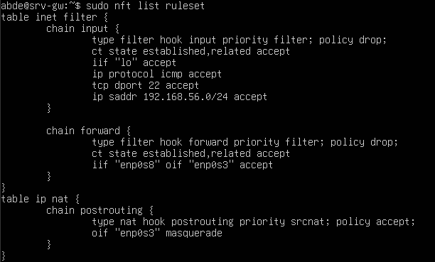

---

## Phase 3 — Connectivity

Configured networking for every server and verified connectivity across the lab.

**Screenshots**

- 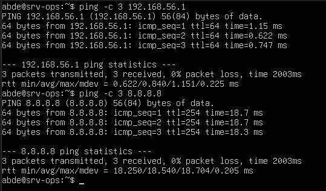

---

## Phase 4 — Configuration Management

Installed Ansible on **srv-ops** and automated the hardening of every machine.

Included:

- Package updates
- UFW
- Fail2Ban
- Unattended upgrades

**Screenshot**

- 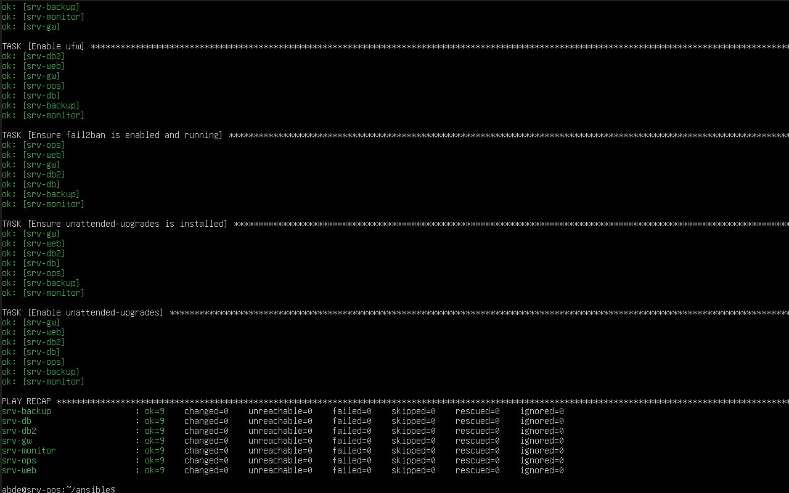

---

## Phase 5 — Docker

Installed Docker on the application servers and deployed **n8n**.

**Screenshots**

- 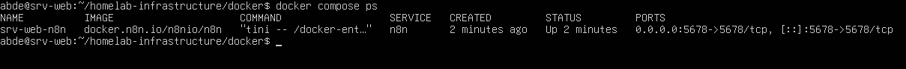
- 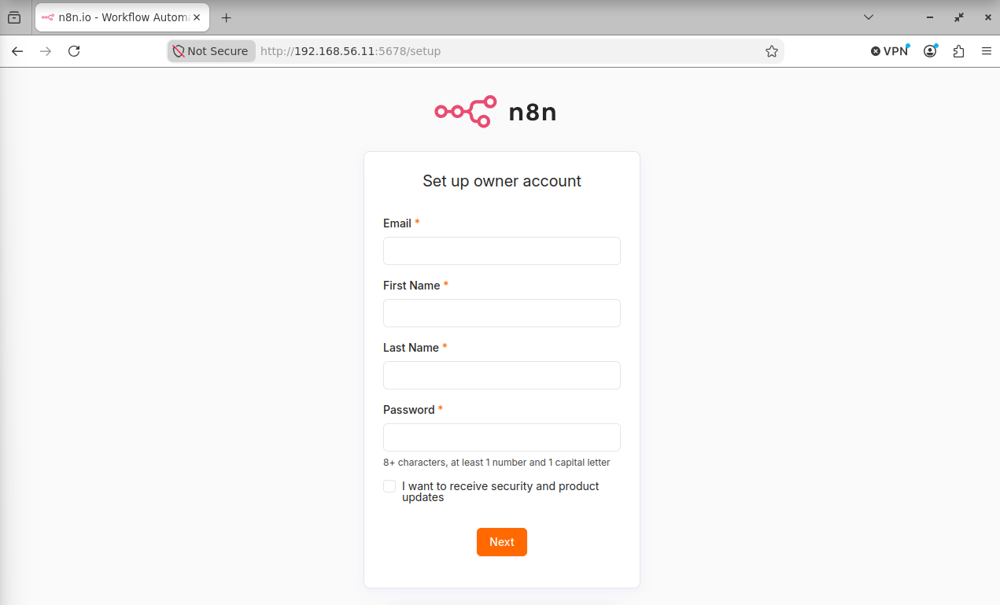

---

## Phase 6 — PostgreSQL High Availability

Configured streaming replication between **srv-db** and **srv-db2**.

**Screenshot**

- 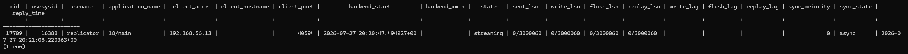

---

## Phase 7 — Monitoring

Deployed Prometheus and Grafana.

Node Exporter collects metrics from every server and Grafana displays them using the Node Exporter Full dashboard.

**Screenshots**

- 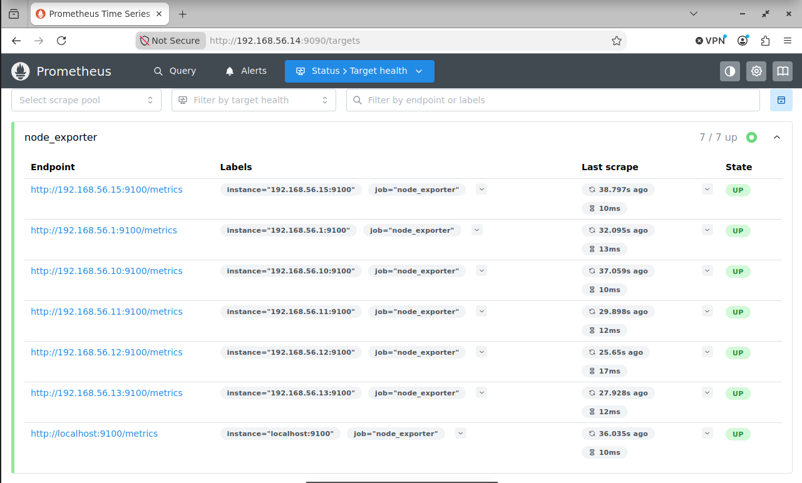
- 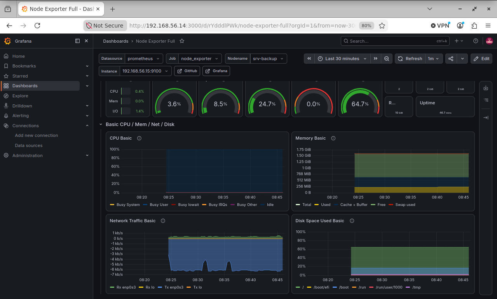

---

## Phase 8 — Backups

Configured Duplicati to back up PostgreSQL dumps and Docker volumes.

Backups are stored from remote servers using SSHFS mounts.

**Screenshots**

- 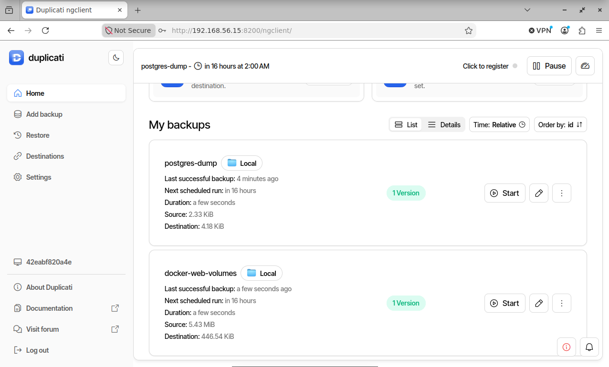
- 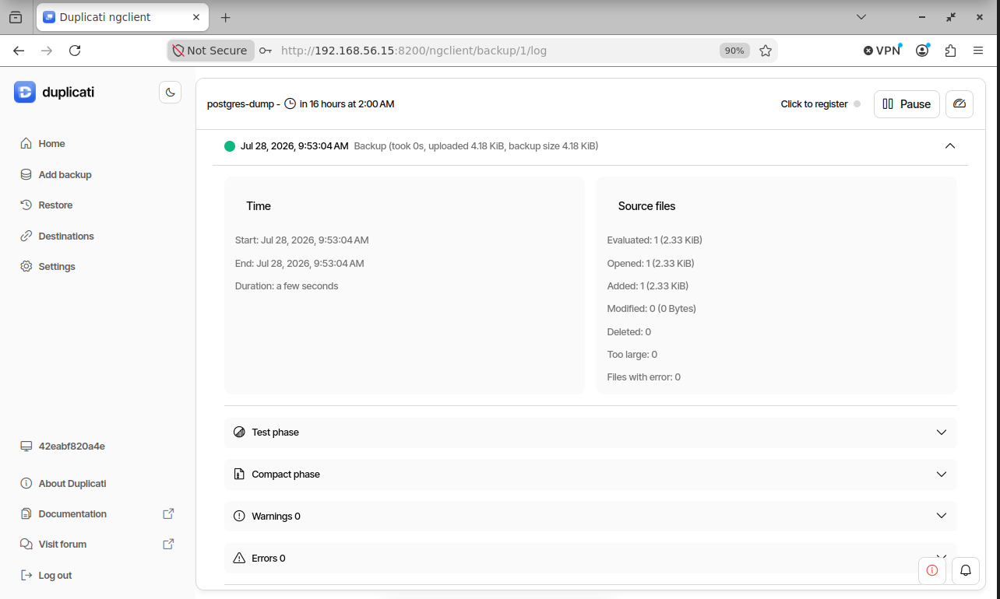

---

# Future work

- Reverse proxy (Nginx)
- HTTPS with Let's Encrypt
- DNS server
- Active Directory integration
- Terraform deployment to Azure
- CI/CD with GitHub Actions
- Kubernetes
- AI automation workflows with n8n